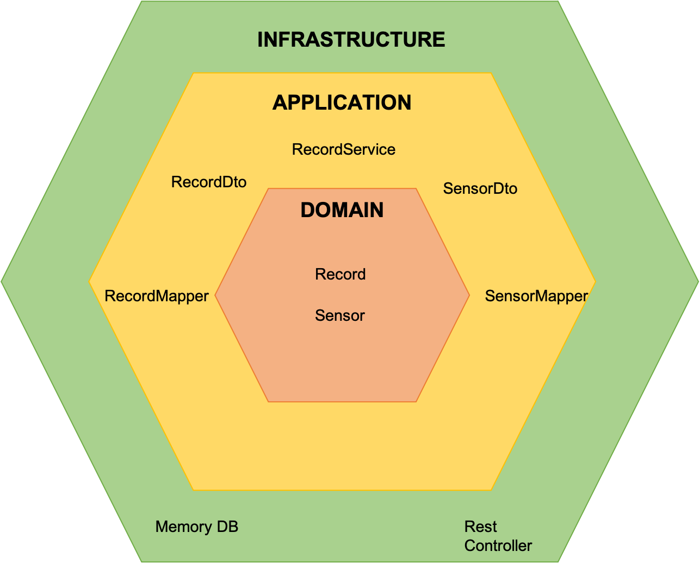

# Sparta consumer server

Java consumer server

## Technologies

- Java 11
- Spring Boot 2.4.5
- Maven 3.6.3

## Architecture: Hexagonal Architectures

Architecture based on Hexagonal Architecture

[[Ref 1]](https://jeffreypalermo.com/2008/07/the-onion-architecture-part-1/)
[[Ref 2]](https://refactorizando.com/ejemplo-de-arquitectura-hexagonal/)
[[Ref 3]](https://github.com/refactorizando-web/spring-data-hexagonal-architecture)
[[Ref 4]](https://alistair.cockburn.us/hexagonal-architecture/)

## Run server

The Spring Boot Maven Plugin provides Spring Boot support in Apache Maven. It allows you to package executable jar or
war archives, run Spring Boot applications, generate build information and start your Spring Boot application prior to
running integration tests.

[Official Documentation](https://docs.spring.io/spring-boot/docs/current/maven-plugin/reference/htmlsingle/)

    mvn spring-boot:run 

## TODO

- ProtoBuff
- Api async --> service async
- actuator --> exponer metricas por provider

